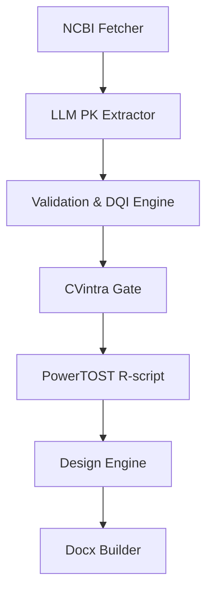

# BE-Insight Core Architecture

Decision-support system for bioequivalence (BE) planning.

## 7-Step Data Flow (MVP)

1. **NCBI Fetcher** (PubMed/PMC)
2. **LLM PK Extractor** (optional; uses PubMed/PMC text)
3. **Validation & DQI Engine**
4. **CVintra Gate** (reported / derived_from_ci / manual / range)
5. **PowerTOST R-script** (sample size & CVfromCI)
6. **Design Engine**
7. **Docx Builder**

## Planned Data Sources (Post-MVP)

Current MVP uses **PubMed/PMC** only. Future versions will integrate:
- **DrugBank**
- **Certara Simcyp**
- **GRLS (rosminzdrav)**

These sources will be used to enrich PK profiles, variability priors, and
regulatory context in later iterations.
